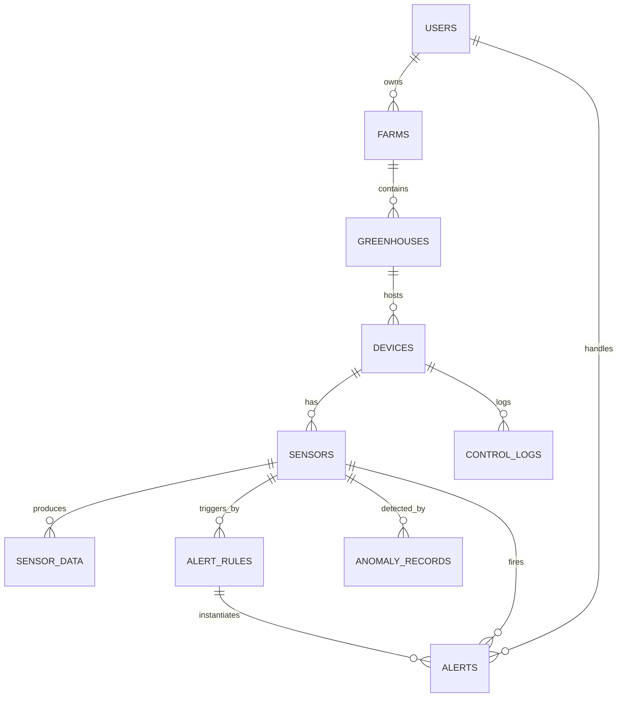

# AgriSense 数据库 ER 图

> 数据存储:SQLite 3 (better-sqlite3)+ WAL 模式
> 文件位置:`/tmp/agri.db`(生产) / `data/agri.db`(本地开发)
> 外键约束:已启用(PRAGMA foreign_keys = ON)
> 索引:`sensor_data(sensor_id, ts)`、`alerts(status, created_at)`、`anomaly_records(sensor_id, ts)`

## 一、ER 关系总览(Mermaid)

## 二、表结构详图

### 1. `users`(用户表)

| 字段 | 类型 | 约束 | 说明 |
|---|---|---|---|
| id | INTEGER | PK, AUTOINCREMENT | 用户主键 |
| email | TEXT | UNIQUE, NOT NULL | 邮箱(登录账号) |
| password | TEXT | NOT NULL | bcrypt 哈希(10 rounds) |
| nickname | TEXT | NOT NULL | 显示昵称 |
| avatar | TEXT | NULL | 头像 URL |
| role | TEXT | DEFAULT 'admin' | `admin` / `viewer` |
| created_at | DATETIME | DEFAULT CURRENT_TIMESTAMP | 创建时间 |

### 2. `farms`(农场表)

| 字段 | 类型 | 约束 | 说明 |
|---|---|---|---|
| id | INTEGER | PK | 农场主键 |
| name | TEXT | NOT NULL | 农场名 |
| address | TEXT | NULL | 地址 |
| owner_id | INTEGER | FK → users.id | 所有者 |
| created_at | DATETIME | DEFAULT CURRENT_TIMESTAMP | - |

### 3. `greenhouses`(大棚表)

| 字段 | 类型 | 约束 | 说明 |
|---|---|---|---|
| id | INTEGER | PK | 大棚主键 |
| farm_id | INTEGER | FK → farms.id, NOT NULL | 所属农场 |
| name | TEXT | NOT NULL | 大棚名 |
| crop_type | TEXT | NULL | 作物类型(tomato / cucumber / strawberry) |
| area | REAL | NULL | 面积(平方米) |
| created_at | DATETIME | DEFAULT CURRENT_TIMESTAMP | - |

### 4. `devices`(设备表 — 传感器采集器 / 控制器)

| 字段 | 类型 | 约束 | 说明 |
|---|---|---|---|
| id | INTEGER | PK | 设备主键 |
| greenhouse_id | INTEGER | FK → greenhouses.id, NOT NULL | 所属大棚 |
| name | TEXT | NOT NULL | 设备名 |
| type | TEXT | NOT NULL | `sensor`(采集器)/ `controller`(控制器) |
| status | TEXT | DEFAULT 'offline' | `online` / `offline` / `fault` |
| last_heartbeat | DATETIME | NULL | 最近心跳时间 |
| capabilities | TEXT | NULL | JSON,例如 `["read_sensors","control_relay"]` |
| created_at | DATETIME | DEFAULT CURRENT_TIMESTAMP | - |

### 5. `sensors`(传感器表 — 5 个采集维度)

| 字段 | 类型 | 约束 | 说明 |
|---|---|---|---|
| id | INTEGER | PK | 传感器主键 |
| device_id | INTEGER | FK → devices.id, NOT NULL | 所属设备 |
| metric | TEXT | NOT NULL | 维度:`temperature` / `humidity` / `soil_moisture` / `light` / `co2` |
| unit | TEXT | NOT NULL | 单位:℃ / % / lux / ppm |
| range_min | REAL | NULL | 量程下限 |
| range_max | REAL | NULL | 量程上限 |

### 6. `sensor_data`(时序数据表 — 核心)

| 字段 | 类型 | 约束 | 说明 |
|---|---|---|---|
| id | INTEGER | PK | 自增主键 |
| sensor_id | INTEGER | FK → sensors.id, NOT NULL | 所属传感器 |
| value | REAL | NOT NULL | 实测值 |
| ts | DATETIME | NOT NULL | 采样时间(ISO8601) |
| quality_flag | INTEGER | DEFAULT 1 | `0=无效` / `1=正常` / `2=异常` |
| created_at | DATETIME | DEFAULT CURRENT_TIMESTAMP | 入库时间 |

**索引**:`(sensor_id, ts)` 复合索引,适配时间窗口查询。

### 8. `alert_rules`(告警规则表)

| 字段 | 类型 | 约束 | 说明 |
|---|---|---|---|
| id | INTEGER | PK | 规则主键 |
| sensor_id | INTEGER | FK → sensors.id, NOT NULL | 监控的传感器 |
| metric | TEXT | NOT NULL | 监测指标 |
| op | TEXT | NOT NULL | 比较运算符:`>` / `<` / `>=` / `<=` / `==` |
| threshold | REAL | NOT NULL | 阈值 |
| severity | TEXT | DEFAULT 'medium' | `low` / `medium` / `high` / `critical` |
| channels | TEXT | NULL | JSON,通知渠道:`['websocket', 'email']` |
| enabled | INTEGER | DEFAULT 1 | 0=禁用 1=启用 |
| created_at | DATETIME | DEFAULT CURRENT_TIMESTAMP | - |

### 9. `alerts`(告警记录表)

| 字段 | 类型 | 约束 | 说明 |
|---|---|---|---|
| id | INTEGER | PK | 告警主键 |
| rule_id | INTEGER | FK → alert_rules.id | 触发的规则 |
| sensor_id | INTEGER | FK → sensors.id, NOT NULL | 关联传感器 |
| metric | TEXT | NOT NULL | 触发指标 |
| value | REAL | NOT NULL | 触发时的实测值 |
| threshold | REAL | NULL | 阈值 |
| severity | TEXT | NULL | 严重等级 |
| status | TEXT | DEFAULT 'pending' | `pending` / `ack` / `resolved` / `ignored` |
| message | TEXT | NULL | 告警文本 |
| handled_by | INTEGER | FK → users.id | 处理人 |
| handled_at | DATETIME | NULL | 处理时间 |
| created_at | DATETIME | DEFAULT CURRENT_TIMESTAMP | 触发时间 |

**索引**:`(status, created_at)` — 适配按状态查询告警列表。

### 10. `anomaly_records`(算法异常记录表)

| 字段 | 类型 | 约束 | 说明 |
|---|---|---|---|
| id | INTEGER | PK | 主键 |
| sensor_id | INTEGER | FK → sensors.id, NOT NULL | 关联传感器 |
| metric | TEXT | NOT NULL | 异常指标 |
| value | REAL | NOT NULL | 异常值 |
| z_score | REAL | NOT NULL | Z-Score 值 |
| window_mean | REAL | NULL | 滑动窗口均值 |
| window_std | REAL | NULL | 滑动窗口标准差 |
| window_size | INTEGER | NULL | 滑动窗口大小 |
| severity | TEXT | DEFAULT 'medium' | 严重等级 |
| method | TEXT | DEFAULT 'zscore' | 检测算法:`zscore` / `iforest` |
| ts | DATETIME | NOT NULL | 异常时间 |
| created_at | DATETIME | DEFAULT CURRENT_TIMESTAMP | - |

### 11. `control_logs`(远程控制日志表)

| 字段 | 类型 | 约束 | 说明 |
|---|---|---|---|
| id | INTEGER | PK | 主键 |
| device_id | INTEGER | FK → devices.id, NOT NULL | 控制设备 |
| action | TEXT | NOT NULL | 控制动作:`turn_on_relay` / `set_temperature` |
| params | TEXT | NULL | JSON 参数 |
| result | TEXT | NULL | JSON 结果 |
| ts | DATETIME | DEFAULT CURRENT_TIMESTAMP | 操作时间 |

## 三、典型数据规模

| 表 | 单条记录大小 | 频率 | 日增 |
|---|---|---|---|
| sensor_data | ~50 B | 5s × 15 sensor | **259,200 行/天** |
| alerts | ~120 B | 阈值触发 | ~10 行/天 |
| anomaly_records | ~80 B | 算法检出 | ~50 行/天 |
| control_logs | ~150 B | 用户操作 | ~5 行/天 |

> 索引开销:对 `sensor_data(sensor_id, ts)` 查询,1 万行 / 50 万行的 EXPLAIN QUERY PLAN 都是 O(log n)。